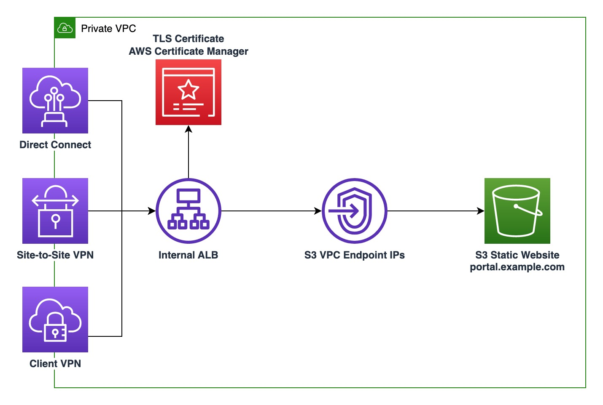

# An Example of Serving Static Website from S3 using Private Link (AWS S3 Interface VPC Endpoint) using CDK.

This example demonstrates how a Static Site can be served using AWS ALB, S3 and Private Link (AWS S3 Interface VPC Endpoint) using AWS CDK.  This example was drived from using [this architecture](https://aws.amazon.com/blogs/networking-and-content-delivery/hosting-internal-https-static-websites-with-alb-s3-and-privatelink/).

*Architecture Credit - AWS/Schuyler Jager*

This project is deployed using AWS CDK in TypeScript.

## What does it build?
* Creates a VPC with Interface Endpoints for S3.  This is required to route database traffic within aws network to S3.
* Creates an Route53 Private Hosted Zone A record
* Creates a S3 bucket with the same domain name for serving website. Also restricts traffic from S3 Interface Endpoints only.
* Creates a Private Application Load Balancer
* Uses a Self-signed certificate, added to ACM that is used to enable TLS for ALB
* Creates an Angular Application for Static Content
* Uses bucket Deployment to automatically build Angular application and generate static content.  The content is then Sent to S3 bucket.
* Creates an EC2 instance (Bastion) so that we can try out this deployment and access to site url

## Steps to run and test
* Deploy the CDK code. Wait for the deploy to finish.  It will print out the Site URL for you to hit.
  * 

## Additional Considerations
* I am using Self-Signed Certificate for TLS with AWS ALB.  You can use AWS Certificate Manager Certificate to make things easier.