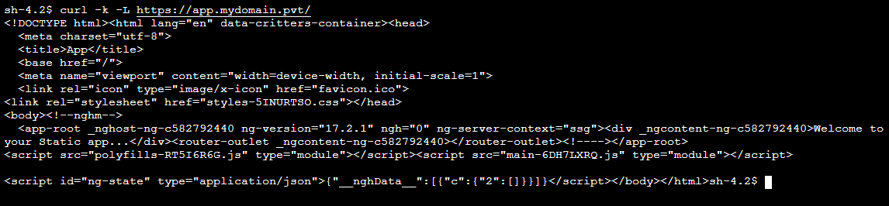

# An Example of Serving Static Website from S3 using AWS S3 Interface VPC Endpoint using CDK.

This example demonstrates how a static site can be served using AWS S3 and AWS S3 Interface VPC Endpoint using AWS CDK.  This example was drived from using [this architecture](https://aws.amazon.com/blogs/architecture/choosing-your-vpc-endpoint-strategy-for-amazon-s3/)

This project is deployed using AWS CDK in TypeScript.

## What does it build?
* Creates a VPC with Interface Endpoints for S3.  This is required to route database traffic within aws network ro S3.
* Creates an Route53 Private hosted Zone A record
* Creates a S3 bucket with the same domain name for serving website. Also restricts trafics from S3 Interface Endpoints only.
* Creates a Private Application Load Balancer
* Uses a Self-signed certificate, added to ACM that is used to enable TLS for ALB
* Creates an Angular App for Static Content
* Uses bucket Deployment to automatically build Angular application and create static content.  the content is then Sent to S3 bucket.
* Creates an EC2 instance so that we can try out this deployment and access to site url

## Steps to run and test
* Deploy the CDK code. Wait for the deploy to finish.  It will print out the Site URL for you to hit.
  * 

## Additional Considerations
* I am using Self-Signed Certificate for TLS with AWS ALB.  You can use AWS Certificate Manager Certificate to make things easier.
* I am not planning to expose this website outside my VPC.  If you want to expose your Website, create a Public Hosted Zone in your VPC.